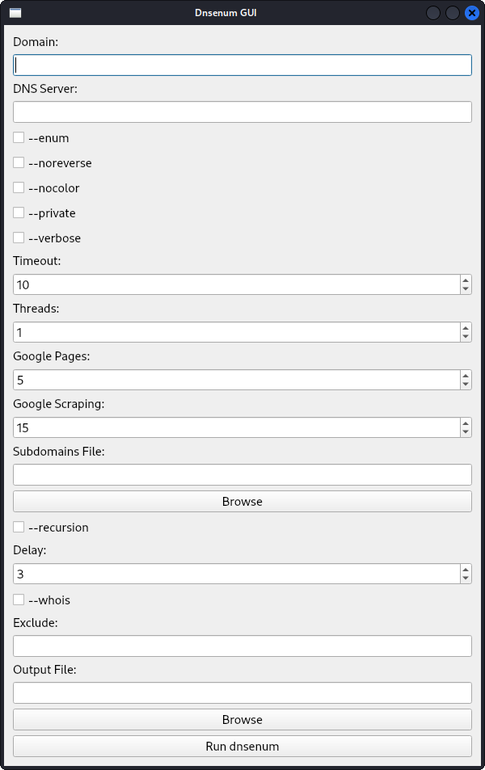

# Dnsenum GUI

Dnsenum GUI is a PyQt-based graphical user interface for the `dnsenum` tool, designed to make DNS enumeration tasks easier and more accessible. This application allows users to configure and run `dnsenum` commands through a user-friendly interface without the need to use the command line.

## Features

- **Domain Input**: Specify the domain to be enumerated.
- **DNS Server**: Option to provide a specific DNS server for the queries.
- **General Options**: Includes options like `--enum`, `--noreverse`, `--nocolor`, `--private`, and `--verbose`.
- **Timeout and Threads**: Set custom timeout and number of threads for the queries.
- **Google Scraping**: Options to specify the number of pages and results to scrape from Google.
- **Subdomains File**: Select a file containing subdomains for brute force enumeration.
- **Brute Force Options**: Includes options like `--recursion`.
- **Whois Netrange**: Set delay between queries and use the `--whois` option.
- **Reverse Lookup Options**: Option to exclude specific results.
- **Output File**: Specify the output file for the results.
- **Run Button**: Execute the configured `dnsenum` command and view the results within the application.

## Installation

1. **Clone the repository:**

    ```bash
    git clone https://github.com/alyaparan/dnsenum-gui.git
    cd dnsenum-gui
    ```

2. **Install dependencies:**

    ```bash
    pip install PyQt5
    ```

3. **Run the application:**

    ```bash
    python dnsenum_gui.py
    ```

## Usage

1. **Enter the domain** you want to enumerate in the "Domain" field.
2. **Optionally, provide a DNS server** in the "DNS Server" field.
3. **Configure general options** by checking the appropriate checkboxes.
4. **Set the timeout** and **number of threads** using the spin boxes.
5. **Configure Google scraping options** by setting the number of pages and results to scrape.
6. **Select a subdomains file** for brute force enumeration, if needed.
7. **Set the delay** for whois netrange queries.
8. **Exclude specific results** by entering them in the "Exclude" field.
9. **Specify an output file** to save the results.
10. **Click the "Run dnsenum" button** to execute the command. The results will be displayed in the output area.

## Screenshots



## Contributing

Contributions are welcome! Please feel free to submit a pull request or open an issue.

## License

This project is licensed under the MIT License. See the [LICENSE](LICENSE) file for details.

## Contact

For questions or concerns, you can contact the project creator at:

- **Website**: [alikparanyan.com](https://alikparanyan.com)
- **Email**: [mail@alikparanyan.com](mailto:mail@alikparanyan.com)
- **Personal Gmail**: [alikparanyan@gmail.com](mailto:alikparanyan@gmail.com)
